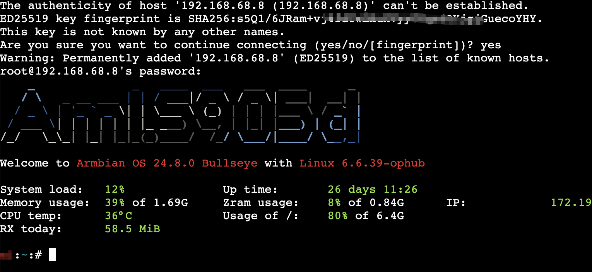

# ttyd: A SSH Client over Web Browser

[](https://hub.docker.com/r/isayme/ttyd)




# Usage

## docker

`docker run --rm -p 1323:1323 -e TTYD_CMD='ssh root@192.168.68.8' isayme/ttyd`

## docker compose

```
services:
  ttyd:
    container_name: ttyd
    image: isayme/ttyd
    port:
      - 1323:1323
    environment:
      # specify ssh connect cmd
      - TTYD_CMD=ssh root@192.168.68.8
    restart: unless-stopped
```
